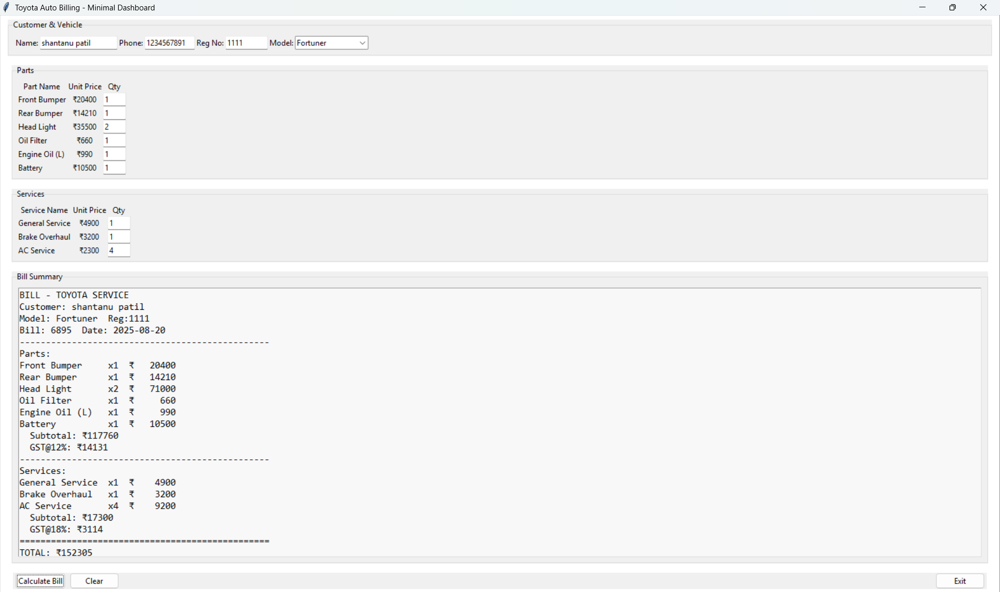

# 🚗 Toyota Auto Billing System
*Toyota Auto Billing System* is a desktop-based billing dashboard built with *Python* and *Tkinter*. It helps manage Toyota car servicing and parts billing efficiently by generating detailed bills for customers based on selected parts, services, and quantities.

## ✨ Features
### Customer & Vehicle Details
- Enter customer information: name, phone number, and registration number.
- Select the Toyota model for the vehicle.

### Parts Section
- Add multiple parts such as bumpers, headlights, filters, engine oil, and battery.
- Automatically calculates *subtotal* and *GST (12%)* for parts.

### Services Section
- Add services like general service, brake overhaul, and AC servicing.
- Automatically calculates *subtotal* and *GST (18%)* for services.

### Bill Summary
- Displays a professional bill format including:
  - Customer details
  - Vehicle model
  - Itemized parts and services
  - Subtotals + GST
  - Final total

### Buttons
- *Calculate Bill* → Generates the final bill.
- *Clear* → Resets all input fields.
- *Exit* → Closes the application.

## 🛠 Tech Stack
- *Language:* Python  
- *GUI Framework:* Tkinter

## 📸 Screenshot

